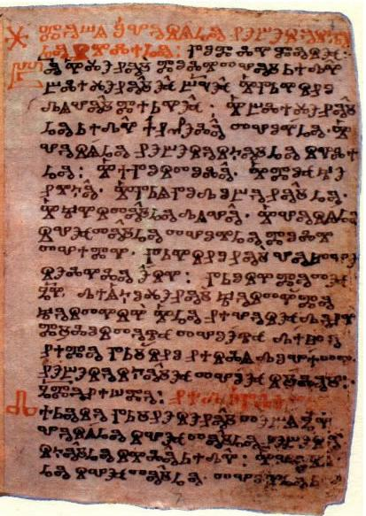
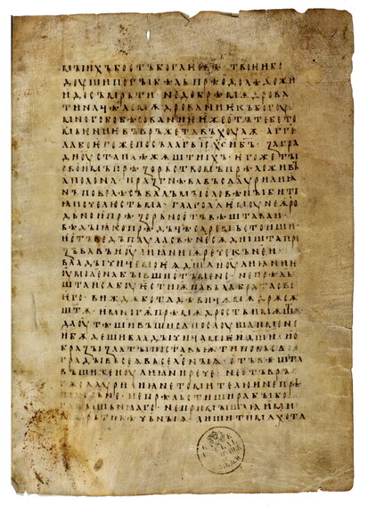

# 古教会スラヴ語

## 文法カテゴリー総覧

名詞類と動詞は, 以下の文法上の区別によって語形が変化します.  
具体的な変化は[記事の最後](#屈折した言語)を参照してください.

1. **性**：男性 / 女性 / 中性  
個々の名詞に性が付与されており, 形容詞, 代名詞, 基数詞の 1 ~ 4, 分詞は名詞の性と一致する.
1. **数**：単数 / 双数 / 複数  
名詞, 形容詞, 代名詞, 動詞は数によって語形が変化する.
1. **人称**：1人称 / 2人称 / 3人称  
動詞の活用に関わる.
1. **格**：名詞およびそれを修飾する形容詞, 代名詞, 基数詞の 1 ~ 4, 分詞の変化に関わる. 主な機能・意味は以下の通り.
    - **主格**：文の主語になる. A = B の関係における B (述語) になる.
    - **生格**：(＝属格) 所有を表す. 存在の否定や奪格由来の分離の意味などもある.
    - **与格**：間接目的語になる. 利得を趣旨とする所有の意味などもある.
    与格の名詞・代名詞およびそれと性数の一致する与格の分詞は,
    それぞれ主語と述語となって全体で時・原因・条件などを意味する従属節となり,
    独立与格と呼ばれている (*cf.* 古典ギリシア語の独立属格) .
    - **対格**：直接目的語になる. 時間的・空間的な広がりを表すこともある.
    - **造格**：(＝具格) 道具や手段, 状態, 時などを表す. A = B の関係における B (述語) になることもある.
    - **所格**：場所や時を表す. 前置詞とともに用いられることが多いが, 前置詞を伴わない例も少数存在する.
    - **呼格**：呼びかけに使われる.
1. **時制**：動詞は直説法でのみ以下の時制を区別する. 後述のアスペクトとも密接に関わっている.
    - **現在**：時について具体的なことを示さない. 同一の動詞形態が文脈によっては現在だけでなく過去も未来も表しうる.
    - **未完了過去**：過去の事態や行為を全体として捉えて「描写」する[^0].
    過去のある時点における動作に注目するのではなく, 出来事の背景を想起させる.
    完了体動詞の用例も確認されているが, ほとんどの場合は不完了体動詞で用いられる.
    - **アオリスト**：過去の出来事を単に「報告」する[^0].
    完了体動詞で用いられることが多いが, 不完了体動詞も珍しくはない.
    - **完了**：発話時点より前の行為の結果が, 発話時点においても影響を及ぼし続けていることを表す.  
    l-分詞 (第2能動過去分詞) と be動詞 *byti* の現在からつくられる複合時制.
    - **過去完了**：過去のある時点よりもさらに前の行為の結果が, 過去のある時点でも影響を及ぼし続けていることを表す.  
    l-分詞と be動詞 *byti* の未完了過去あるいは不完了体アオリストからつくられる複合時制.
1. **アスペクト**：完了体 / 不完了体  
個々の動詞にいずれかのアスペクト (スラヴ語学では**体**という訳語を使う) が付与される.
ただし be動詞 *byti* は完了体の語幹 *bǫd-*, *by-* と不完了体の語幹 *bě-*, *jes-*, *s-* をもっている.
完了体は動作や過程が終わりに達することを示し, 不完了体は動作が完了しているかどうかについて明示しない.
1. **法**：直説法 / 命令法 / 条件法  
条件法は l-分詞と助動詞 *bimь* (後の時代では be動詞 *byti* の完了体アオリスト) の組み合わせによって示される.
1. **態**  
分詞に能動 / 受動の区別があるが, いわゆる受動態を形成する体系的な手段はない.
受動分詞と be動詞 *byti* の組み合わせによって,
あるいは他動詞と再帰代名詞の対格 *sę* が結びついた再帰動詞によって受動の意味を表現することもある.

[^0]:木村, 2003, p.138

## どんな言語？

古教会スラヴ語とは,
9~11世紀[^1]にかけて主にブルガリア周辺[^2]で書かれた,
スラヴ語最古の**文章語**です.
キリスト教の聖典をスラヴ語に翻訳するために,
当時の**スラヴ人の口語**と**ギリシア語**をもとにして,
ビザンツ帝国の兄弟・コンスタンティノス (修道名キュリロス) とメトディオスが作り上げたと言われています.  

スラヴ語とは,
ロシア語やウクライナ語,
ポーランド語, チェコ語,
ブルガリア語, セルビア語, クロアチア語, スロベニア語などといった,
主に東ヨーロッパで話されている言語のグループ (スラヴ語派) のことを指します.
スラヴ語はみな共通の祖先となる言語,
スラヴ祖語から分化した言語群であり,
古教会スラヴ語は記録に残っているなかで**最もスラヴ祖語に近い言語**です.
しかし祖語に近いとは言え既に方言的特徴も現れてきており,
古教会スラヴ語はその音の特徴から南スラヴ語に分類されます[^3].

[^1]:12世紀以降のものは, 古教会スラヴ語とは呼ばない.
これは, 12世紀前後, スラヴ語の各地の方言が徐々に文献に現れはじめ一体性が失われつつあったため,
便宜的に設けた線引きである.
12世紀以降の教会スラヴ語は, 地方ごとに名前を付けてブルガリア教会スラヴ語,
マケドニア教会スラヴ語, セルビア教会スラヴ語などと呼び分けることになっている.
[^2]: 当初はモラヴィア王国 (現チェコ, スロバキア一帯) で広められたが, 西方教会側の圧力により活動の場は東に移り,
ブルガリアで文化的に大きく発展した.
[^3]: 主な根拠は, スラヴ祖語で想定される子音結合 \*tj, \*dj がそれぞれ št, žd という形で現れるという,
現代のブルガリア語に特徴的な音対応が古教会スラヴ語にも見られる点にある.

**言語の名称**

古(代)教会スラヴ語は別名,
古(代)スラヴ語,
古(代)ブルガリア語などと呼ばれることもあります.
この言語が成立したそもそもの経緯は聖典をスラヴ語へ翻訳することだったこと,
現存している資料もほとんどが教会関連のものであることから,
日本や欧米では古(代)**教会**スラヴ語
(英: Old **Church** Slavonic, 独: Alt**kirchen**slawisch)
と呼ぶのが一般的です.
一方ロシアやチェコなどではスラヴの文章語であるという広い意味で古(代)スラヴ語
(露: Старо**славян**ский, チェコ: Staro**slověn**ština) と,
ブルガリアではスラヴ語文化の揺籃の地であることから古(代)ブルガリア語 (Старо**българ**ски) と呼ぶことが多いようです.  

また従来は単に「古い」という意味で「古代○○語」という呼び方をしていたようですが,
実際には中世に書かれた言語であり歴史学における「古代」と紛らわしいため,
近年は「古○○語」という呼び方が広まってきているとのことです.
当サイトでもこれにならって「古教会スラヴ語」と呼ぶことにします。

## どんな風に書かれているの？

### テキスト

とりあえずどんな言語なのか見てみましょう.
１つ目は何となく読めそうな気もしますが,
２つ目はいかがでしょうか.

1. 聖者伝『福者グレゴリウスと天使』​(スプラシル写本 page 61r, line 26~)

    

    >тъ же блаженꙑ григории. ѥг᾽да сѣдѣаше въ хꙑзинѣ своѥи. и писааше.
    >приде къ н҄емѹ маломоштъ. молꙙ и и глагол҄ꙙ. момилѹи мꙙ рабе б҃а вꙑшьнꙗго.
    >ꙗко старѣишина бѣхъ кораб᾽никомъ.
    >и истопихомъ сꙙ и погѹбихомъ много имѣниѥ. и своѥ и стѹжде
    <!--blockquoteを分割-->
    >さてこの福者グレゴリウスが, 自分の独房にすわって書きものをしていたとき,
    >彼のもとへ, [ひとりの] 貧者が来て, 懇願して [こう] 言った. «いと高き神のしもべよ, わたしをお憐れみください,
    >なぜならわたしは船乗りのかしらでしたが,
    >われわれは, 難破して, 自分のも他人のも [ふくめて] 多くの財産をなくしたからです»   (木村, 2003, p.176)

    

1. マタイによる福音書 7:7 (マリア写本)

    

    >ⱂⱃⱁⱄⰻⱅⰵ ⰻ ⰴⰰⱄⱅⱏ ⱄⱔ ⰲⰰⰿⱏ. ⰺⱋⱑⱅⰵ ⰻ ⱁⰱⱃⱔⱋⰵⱅⰵ.
    >ⱅⰾⱏⱌⱑⱅⰵ ⰻ ⱁⱅⰲⱃⱏⰸⰵⱅⱏ ⱄⱔ ⰲⰰⰿⱏ.
    <!--blockquoteを分割-->
    >求めよ, さらば与えられん. 尋ねよ, さらば見出さん.
    >門を叩け, さらば開かれん.

    

### 写本

|キエフ断片|
|:--:|
||

|スプラシル写本|
|:--:|
||

古教会スラヴ語の資料の大半は,
上の画像のような**羊皮紙**の写本です.
2022年現在,
9世紀の資料は発見されておらず,
見つかっている資料のうち一部は10世紀,
大半が11世紀のものです.  
資料の数は限られており,
主要なものをすべて足し合わせても1500葉 (3000ページ) ほどしかありません.
読もうと思えば生きているうちに読破可能です.
お試しあれ.

主な資料

|資料|使用文字|内容|分量|年代|備考|
|----|----|----|----|----|----|
|ゾグラフォス写本|グ⁠ラ⁠ゴ⁠ル⁠文⁠字|四福音書|303葉|10⁠~⁠11⁠世⁠紀|1843年, ギリシア・アトス山にあるゾグラフォス修道院で発見される.|
|マリア写本|グラゴル文字|四福音書|174葉|11世紀初|1845年頃, ギリシア・アトス山にあった生神女 (マリア) 修道院​の​僧庵で発見される.|
|アッセマーニ写本|グラゴル文字|アプラコス[^7]|158葉|11世紀初|1736年, イタリアのイエズス会士​アッセマーニによって​エルサレムで​発見される. 後に甥がバチカン図書館に寄贈し現在に至る.|
|シナイ詩篇|グラゴル文字|詩篇|177⁠+⁠32⁠葉|11世紀|1850年, エジプト・シナイ山にある聖カタリナ修道院で発見される.   1968年, その続き32葉が追加で発見される. 現在も同修道院が所蔵.|
|シナイ祈⁠祷⁠書|グラゴル文字|祈祷書|109+28葉|11世紀|詩篇と同じく1850年に聖カタリナ修道院で発見される.   1975年, 28葉が新たに発見される. 現在も同修道院が所蔵.|
|クローツ文⁠書|グラゴル文字|説教集|14葉|11世紀|14⁠葉⁠の⁠う⁠ち⁠の⁠12⁠葉⁠は⁠19⁠世⁠紀⁠前⁠半⁠ま⁠でクローツ伯爵という人物が所有していた.   残り2葉はスロベニアのスラヴ語学者フランツ・ミクロシッチが発見.|
|サバの本|キリル文字|アプラコス|129葉|11世紀|1866年, モスクワの出版社 Здание Синодальной типографии の書庫で発見される. 名の由来は写し手と思われる司祭サバ (Савва) から.|
|スプラシル写⁠本|キリル文字|聖者伝|285葉|10世紀|1823年, ポーランド・スプラシルにある受胎告知修道院で発見される.|
|エ⁠ニ⁠ナ・ア⁠ポ⁠ス⁠ト⁠ル|キリル文字|使徒行伝|39葉|11世紀|1960年, ブルガリア・エニナ村で修復中だった教会の壁の中から発見される.|
|キエフ断⁠片|グラゴル文字|ロ⁠ー⁠マ・ミ⁠サ⁠典⁠礼⁠書|7葉|10世紀|19世紀にエルサレムで発見され, 後にキエフ神学アカデミーに寄贈される. 確認されているなかで最古の資料. 南スラヴ語的でない特徴が見られる.|

[^7]:福音書の内容を, 毎週日曜日に教会で読むときの順番に並べ替えたもの. 復活祭を基準に1年周期で読まれる.

## ２つの文字

上の２つのテキストで見たように,
古教会スラヴ語には２種類の文字体系が使われています[^4].
ひとつは現在でもロシア語やウクライナ語,
ブルガリア語などで使われている**キリル文字**です.
１番目のテキスト・スプラシル写本はキリル文字で書かれており,
ロシア語などを学んでいる人なら,
少しだけ見慣れない文字はあるにせよ,
何となく読める気がすると思います.  

もう一方の文字は,
**グラゴル文字**と言います.
現代ではこの文字はほとんど使われておらず,
19世紀前半にクロアチア沿岸部の教会が使っていたのを最後に常用されなくなってしまいました.
いまでもクロアチアなどへ行くと土産物屋でグラゴル文字のキーホルダーが売られたりしているそうですが,
日本に暮らしている限りはなかなかお目にかかれないでしょう.  

ちなみに, キリル文字はキュリロスの名に由来していますが,
彼が実際に考案したのはグラゴル文字の方だというのが定説です[^5].

[^4]:日本語の漢字かな混じり文のように混ぜて使うことはない.
[^5]:[関連記事](https://huling.org/docs/rus#%E6%96%87%E5%AD%97).

文字一覧

|グ⁠ラ⁠ゴ⁠ル⁠文⁠字|キ⁠リ⁠ル⁠文⁠字|ラ⁠テ⁠ン⁠文⁠字|音⁠価|例|
|:--:|:--:|:--:|:--:|:--|
|ⰰ|а|a|/a/|「ア」|
|ⰱ|б|b|/b/|「バ」の子音|
|ⰲ|в|v|/v/|英 ***v**ast*|
|ⰳ|г|g|/g/|「ガ」の子音|
|ⰴ|д|d|/d/|「ダ」の子音|
|ⰵ|е|e|/ɛ/|英 *b**e**d*|
|ⰶ|ж|ž|/ʒ/|英 *mea**s**ure*|
|ⰷ|ѕ|ʒ[^6]|/d͡z/|英 *car**ds***|
|ⰸ|ꙁ з|z|/z/|英 *car**s***|
|ⰹ|і|i|/i/|「イ」. 場合によっては /ji/ のような発音も想定される.   例: краи = *kraji|
|ⰺ|ꙇ|i|/i/|^|
|ⰻ|и|i|/i/|^|
|ⰼ|(ћ)|ǵ|/gʲ/?|正確な音価は不明   古代ギリシア語における前舌母音の前の *γ* (ガンマ) と対応している|
|ⰽ|к|k|/k/|「カ」の子音|
|ⰾ|л|l|/l/|英 ***l**ast*|
|ⰿ|м|m|/m/|「マ」の子音|
|ⱀ|н|n|/n/|「ナ」の子音|
|ⱁ|о|o|/ɔ/|英 *l**o**rd*|
|ⱂ|п|p|/p/|「パ」の子音|
|ⱃ|р|r|/r/|巻き舌. 河内弁の '*シバくぞ ワ**レ**ェ*'|
|ⱄ|с|s|/s/|「サ」の子音|
|ⱅ|т|t|/t/|「タ」の子音|
|ⱆ|ѹ|u|/u/|英 *wh**o***|
|ⱇ|ф|f|/f/, /p/|英 ***ph**one*   発音の揺れがあった|
|ⱚ|ѳ|th|/θ/, /t/| 英 ***th**eme*   発音の揺れがあった|
|ⱈ|х|x|/x/|独 *Bu**ch***   日 *マッ**ハ***|
|ⱉ|ѡ|o|/ɔ/|英 *l**o**rd*|
|ⱋ|щ|št|/ʃt/|英 *ha**shed***|
|ⱌ|ц|c|/t͡s/|「ツ」の子音|
|ⱍ|ч|č|/t͡ʃ/|英 ***ch**ampion*|
|ⱎ|ш|š|/ʃ/|英 ***sh**rimp*|
|ⱏ|ъ|ъ (ŭ)|/ɯ/?|ごく弱い「ウ」  正確な音価は不明|
|ⱏⰹ|ꙑ|y|/ɨ/|露 *д**ы**м*|
|ⱐ|ь|ь (ĭ)|/i/?|ごく弱い「イ」   正確な音価は不明|
|ⱑ|ѣ|ě|/æ/|英 *c**a**t*   方言差あり. キュリロスの方言では /æ/|
|ⱓ|ю|ju|/ju/|ユ|
|-|ꙗ|ja|/ja/|ヤ|
|-|ѥ|je|/jɛ/|イェ|
|ⱔ (ⱗ)|ѧ|ę|/ɛ̃/|仏 *pl**ein***   日 *ご**縁***|
|ⱘ|ѫ|ǫ|/ɔ̃/|仏 *s**on***   日 *ご**恩***|
|ⱗ|ѩ|ję|/jɛ̃/|仏 *ch**ien***   日 *ぴ**えん***|
|ⱙ|ѭ|jǫ|/jɔ̃/|仏 *cra**yon***   日 *ガチ**ョーン***|
|-|ѯ|ks|/ks/|英 *bo**x***|
|-|ѱ|ps|/ps/|英 *dro**ps***|
|ⱛ|ѵ|ü|/ʏ/|独 *f**ü**nf*|

## 音韻

以下, 簡単のために, 音や形態について記述するときは上表「文字一覧」におけるラテン文字表記を用います.

### 母音

<table><thead><tr><th style="text-align:center;" colspan="4">口母音</th><th style="text-align:center;" colspan="2">鼻母音</th></tr></thead><tbody><tr><td style="text-align:center;" rowspan="2"></td><td style="text-align:center;"><strong>前舌</strong></td><td style="text-align:center;" colspan="2"><strong>後舌</strong></td><td style="text-align:center;" rowspan="2"><strong>前舌</strong></td><td style="text-align:center;" rowspan="2"><strong>後舌</strong></td></tr><tr><td style="text-align:center;"><strong>非⁠円⁠唇</strong></td><td style="text-align:center;"><strong>非⁠円⁠唇</strong></td><td style="text-align:center;"><strong>円⁠唇</strong></td></tr><tr><td style="text-align:center;"><strong>狭</strong></td><td style="text-align:center;">i</td><td style="text-align:center;">y</td><td style="text-align:center;">u</td><td style="text-align:center;" rowspan="4">ę</td><td style="text-align:center;" rowspan="4">ǫ</td></tr><tr><td style="text-align:center;"></td><td style="text-align:center;">ь</td><td style="text-align:center;">ъ</td><td style="text-align:center;"></td></tr><tr><td style="text-align:center;"></td><td style="text-align:center;">e</td><td style="text-align:center;"></td><td style="text-align:center;">o</td></tr><tr><td style="text-align:center;"><strong>広</strong></td><td style="text-align:center;">ě</td><td style="text-align:center;">a</td><td style="text-align:center;"></td></tr></tbody></table>

#### 鼻母音

古教会スラヴ語の特徴のひとつとして,
鼻母音 ę, ǫ の存在が挙げられます.
鼻母音は現代のスラヴ語においてはポーランド語を除いて消失してしまい,
しかもポーランド語の鼻母音 ę /ɛ̃/, ą /ɔ̃/ も厳密には古教会スラヴ語の ę, ǫ と対応していないため,
スラヴ祖語の姿を探る重要な手がかりになります.

#### 弱化母音 (イェル)

鼻母音と並ぶ古教会スラヴ語のもうひとつの特徴が,
弱化母音 (**イェル**, 英: jers) ь, ъ です.
それぞれ,
非常に弱い「ィ」および「ゥ」という**母音**であり,
front jer (前舌のイェル) , back jer (後舌のイェル) と呼ばれています.
弱化母音は語末においてほとんど発音されなかったと考えられており,
現代のスラヴ語では綴りの上でもほとんど消え去っています[^8].

イェルはラテン文字で ĭ, ŭ と表されることもありますが,
ふつうはラテン文字表記でもキリル文字 ь, ъ をそのまま用います.

[^8]:ロシア語では1918年の正書法改革まで語末のイェルが綴りの上で保持されていた.  
例：旧正書法: миръ ⇔ 現正書法: мир (mir)「平和」  
しかしこれは母音ではなく日本語における濁点 (゛) や半濁点 (゜) のような記号の役割を果たしており,
back jer は直前の子音字が硬子音 (非硬口蓋化子音) であることを,
front jer は軟子音 (硬口蓋化子音) であることを示していた.
また必ずしも語源的に正しく用いられていたわけではなく,
bez という前置詞は本来 без と綴られるところを旧正書法では безъ としていた.
非硬口蓋化子音は音声的に無標であるため, 語末の back jer は実用上必要なく正書法改革で廃止されたが,
硬口蓋化子音は有標であるため front jer は現代でも軟音記号として残っている.

### 子音

| |唇⁠音|歯⁠茎⁠音|硬⁠口⁠蓋⁠音|軟⁠口⁠蓋⁠音|
|:---:|:---:|:---:|:---:|:---:|
|**破⁠裂⁠音**|p b|t d| ​|k g|
|**破⁠擦⁠音**| ​|c ʒ[^6]|č|​ |
|**摩⁠擦⁠音**|v|s z|š ž|x|
|**鼻⁠音**|m|n|ń| ​|
|**流⁠音**|​ |l r|ľ ŕ|​ |
|**半⁠母⁠音**| ​|​ |j| ​|

[^6]:IPA (国際音声記号) における有声後部歯茎摩擦音ではないので注意.

#### 硬い子音と軟らかい子音

子音は,
形態音韻論の観点から**硬子音**と**軟子音**という2つのグループに分けることができます.

**軟子音**: c ʒ č ž š ń ľ ŕ j št žd  
**硬子音**: p b v m t d s z n l r k g x

この分類は,
実際の発音がどうであったかというよりも,
語形変化や派生に際してどのような母音を後ろに取るのかという点に基づいています.
ごくおおまかに言えば,
軟子音は歴史的に前舌母音や硬口蓋接近音 \[j] などによって**硬口蓋化**[^9]された子音に由来しているため[前舌母音][母音表]を後ろに従えることが多く,
硬子音は[後舌母音][母音表]を従えることが多いです.  

[^9]:硬口蓋化：子音を発音するときに, 舌が上あご(硬口蓋)に向かって盛り上がる現象.
日本語のイ段 (キ, シ, チ...) の子音は硬口蓋化されている.
特に軟口蓋音は硬口蓋化によって大きく音が変化することがあり,
たとえば英語の church やイタリア語の ciao も, 綴りから分かるように元来 /k/ だった音が /t͡ʃ/ に変化している.

より細かく音素配列を見ると, 硬子音と軟子音はそれぞれさらに２つのグループに分けることができます.
下表は, ４つの子音グループについて, どの母音を後ろに取ることができるのかを示しています (\[+] は母音がその子音に後続できることを, \[-] は後続できないことを示す) .
硬子音のうち軟口蓋音 k g x を除いたもの (表の最終行の子音群) は任意の母音を取ることができ,
Lunt (2001) はこれを “neutral consonants” と呼んでいます.
<table><thead><tr><th style="text-align:left;"></th><th style="text-align:center;" colspan="5">前舌母音</th><th style="text-align:center;" colspan="6">後舌母音</th></tr></thead><tbody><tr><td style="text-align:left;"></td><td style="text-align:center;"><strong>i</strong></td><td style="text-align:center;"><strong>ь</strong></td><td style="text-align:center;"><strong>e</strong></td><td style="text-align:center;"><strong>ě</strong></td><td style="text-align:center;"><strong>ę</strong></td><td style="text-align:center;"><strong>y</strong></td><td style="text-align:center;"><strong>ъ</strong></td><td style="text-align:center;"><strong>o</strong></td><td style="text-align:center;"><strong>u</strong></td><td style="text-align:center;"><strong>a</strong></td><td style="text-align:center;"><strong>ǫ</strong></td></tr><tr><td style="text-align:left;"><strong>č&nbsp;ž&nbsp;š št&nbsp;žd ń&nbsp;ľ&nbsp;ŕ&nbsp;j</strong></td><td style="text-align:center;">+</td><td style="text-align:center;">+</td><td style="text-align:center;">+</td><td style="text-align:center;">-</td><td style="text-align:center;">+</td><td style="text-align:center;">-</td><td style="text-align:center;">-</td><td style="text-align:center;">-</td><td style="text-align:center;">+</td><td style="text-align:center;">+</td><td style="text-align:center;">+</td></tr><tr><td style="text-align:left;"><strong>c ʒ</strong></td><td style="text-align:center;">+</td><td style="text-align:center;">+</td><td style="text-align:center;">+</td><td style="text-align:center;">+</td><td style="text-align:center;">+</td><td style="text-align:center;">-</td><td style="text-align:center;">-</td><td style="text-align:center;">-</td><td style="text-align:center;">+</td><td style="text-align:center;">+</td><td style="text-align:center;">+</td></tr><tr><td style="text-align:left;"><strong>k g x</strong></td><td style="text-align:center;">-</td><td style="text-align:center;">-</td><td style="text-align:center;">-</td><td style="text-align:center;">-</td><td style="text-align:center;">-</td><td style="text-align:center;">+</td><td style="text-align:center;">+</td><td style="text-align:center;">+</td><td style="text-align:center;">+</td><td style="text-align:center;">+</td><td style="text-align:center;">+</td></tr><tr><td style="text-align:left;"><strong>p&nbsp;b t&nbsp;d s&nbsp;z v m&nbsp;n l&nbsp;r</strong></td><td style="text-align:center;">+</td><td style="text-align:center;">+</td><td style="text-align:center;">+</td><td style="text-align:center;">+</td><td style="text-align:center;">+</td><td style="text-align:center;">+</td><td style="text-align:center;">+</td><td style="text-align:center;">+</td><td style="text-align:center;">+</td><td style="text-align:center;">+</td><td style="text-align:center;">+</td></tr></tbody></table>

(Lunt, 2001, p.33 より引用・改変した)

## 屈折した言語

古教会スラヴ語は名詞類や動詞の**語形変化 (屈折)** が非常に豊かな言語です.
名詞類は**性・数・格**の区別を,
動詞は**人称・数・時制・アスペクト・法**の区別をもち,
語形変化などによってこれらの文法情報を義務的に示さなければいけません.

### 名詞類

#### 名詞

名詞にはいくつかの語幹のタイプがあり, それによって変化のしかたが異なります.
理論的には, すべての名詞は
o-語幹, jo-語幹, a-語幹, ja-語幹, i-語幹, u-語幹, 子音語幹[^10]
のいずれかひとつに分類されますが,
実際には o/jo-語幹の名詞が u-語幹と同じ変化をしたり,
子音語幹の名詞が o-語幹の変化をしたりすることもあります.  

原則として
o/jo-語幹は男性あるいは中性名詞,
a/ja-語幹は女性名詞,
i-語幹は女性名詞と少数の男性名詞,
u-語幹は男性名詞になります.  

o-語幹, a-語幹名詞の変化のことを硬変化,
jo-語幹, ja-語幹名詞の変化のことを軟変化と呼び,
上述の[硬子音と軟子音](#硬い子音と軟らかい子音)の区別が形態論のレベルで現れてきます.

[^10]:子音語幹名詞は, ほとんどの場合, 単数主格 (あるいはそれに等しい対格・呼格) だけ特別な語幹をもつ.
細分すると v-語幹, r-語幹, n-語幹, s-語幹, nt-語幹 から成る.
v-語幹は印欧祖語の形を念頭に置いて ū-語幹とも呼ばれる.

語幹ごとの格語尾

子音幹については -(典型的な語幹末尾)-(格語尾) を示している.
∅ はゼロ語尾.

<table><thead><tr><th style="text-align:center;" colspan="2"></th><th>o-‌語幹</th><th>jo-‌語幹</th><th>a-‌語幹</th><th>ja-‌語幹</th><th>i-‌語幹</th><th>u-‌語幹</th><th>v-‌語幹</th><th>r-‌語幹</th><th>s-‌語幹</th><th>n-‌語幹</th><th>nt-‌語幹</th></tr></thead><tbody><tr><td style="text-align:center;" colspan="2"><strong>性</strong></td><td>男 / 中</td><td>男 / 中</td><td>女 / 男</td><td>女 / 男</td><td>女 / 男</td><td>男</td><td>女</td><td>女</td><td>中</td><td>中</td><td>中</td></tr><tr><td style="text-align:center;" rowspan="7"><strong>単数</strong></td><td style="text-align:center;"><strong>主</strong></td><td>-‌ъ / -‌o</td><td>-‌ь / -‌e</td><td>-‌a</td><td>-‌a</td><td>-‌ь</td><td>-‌ъ</td><td>-‌y-‌∅</td><td>-‌i-‌∅</td><td>-‌o-‌∅</td><td>-‌ę-‌∅</td><td>-‌ę-‌∅</td></tr><tr><td style="text-align:center;"><strong>生</strong></td><td>-‌a</td><td>-‌a</td><td>-‌y</td><td>-‌ę</td><td>-‌i</td><td>-‌u</td><td>-‌ъv-‌e</td><td>-‌er-‌e</td><td>-‌es-‌e</td><td>-‌en-‌e</td><td>-‌ęt-‌e</td></tr><tr><td style="text-align:center;"><strong>与</strong></td><td>-‌u</td><td>-‌u</td><td>-‌ě</td><td>-‌i</td><td>-‌i</td><td>-‌ovi</td><td>-‌ъv-‌i</td><td>-‌er-‌i</td><td>-‌es-‌i</td><td>-‌en-‌i</td><td>-‌ęt-‌i</td></tr><tr><td style="text-align:center;"><strong>対</strong></td><td>-‌ъ / -‌o</td><td>-‌ь / -‌e</td><td>-‌ǫ</td><td>-‌ǫ</td><td>-‌i</td><td>-‌ъ</td><td>-‌ъv-‌ь</td><td>-‌er-‌ь</td><td>-‌o-‌∅</td><td>-‌ę-‌∅</td><td>-‌ę-‌∅</td></tr><tr><td style="text-align:center;"><strong>造</strong></td><td>-‌omь</td><td>-‌emь</td><td>-‌ojǫ</td><td>-‌ejǫ</td><td>-‌ьjǫ / -‌ьmь</td><td>-‌ъmь</td><td>-‌ъv-‌ьjǫ</td><td>-‌er-‌ьjǫ</td><td>-‌es-‌ьmь</td><td>-‌en-‌ьmь</td><td>-‌ęt-‌ьmь</td></tr><tr><td style="text-align:center;"><strong>所</strong></td><td>-‌ě</td><td>-‌i</td><td>-‌ě</td><td>-‌i</td><td>-‌i</td><td>-‌u</td><td>-‌ъv-‌e</td><td>-‌er-‌e</td><td>-‌es-‌e</td><td>-‌en-‌e</td><td>-‌ęt-‌e</td></tr><tr><td style="text-align:center;"><strong>呼</strong></td><td>-‌e / -‌o</td><td>-‌u / -‌e</td><td>-‌o</td><td>-‌e</td><td>-‌i</td><td>-‌u</td><td>-‌y-‌∅</td><td>-‌i-‌∅</td><td>-‌o-‌∅</td><td>-‌ę-‌∅</td><td>-‌ę-‌∅</td></tr><tr><td style="text-align:center;" rowspan="6"><strong>複数</strong></td><td style="text-align:center;"><strong>主⁠呼</strong></td><td>-‌i / -‌a</td><td>-‌i / -‌a</td><td>-‌y</td><td>-‌ę</td><td>-i / -‌ьje</td><td>-‌ove</td><td>-‌ъv-‌i</td><td>-‌er-‌i</td><td>-‌es-‌a</td><td>-‌en-‌a</td><td>-‌ęt-‌a</td></tr><tr><td style="text-align:center;"><strong>生</strong></td><td>-‌ъ</td><td>-‌ь</td><td>-‌ъ</td><td>-‌ь</td><td>-‌ьi</td><td>-‌ovъ</td><td>-‌ъv-‌ъ</td><td>-‌er-‌ъ</td><td>-‌es-‌ъ</td><td>-‌en-‌ъ</td><td>-‌ęt-‌ъ</td></tr><tr><td style="text-align:center;"><strong>与</strong></td><td>-‌omъ</td><td>-‌emъ</td><td>-‌amъ</td><td>-‌amъ</td><td>-‌ьmъ</td><td>-‌ъmъ</td><td>-‌ъv-‌emъ</td><td>-‌er-‌emъ</td><td>-‌es-‌emъ</td><td>-‌en-‌emъ</td><td>-‌ęt-‌emъ</td></tr><tr><td style="text-align:center;"><strong>対</strong></td><td>-‌y / -‌a</td><td>-‌ę / -‌a</td><td>-‌y</td><td>-‌ę</td><td>-‌i</td><td>-‌y</td><td>-‌ъv-‌i</td><td>-‌er-‌i</td><td>-‌es-‌a</td><td>-‌en-‌a</td><td>-‌ęt-‌a</td></tr><tr><td style="text-align:center;"><strong>造</strong></td><td>-‌y</td><td>-‌i</td><td>-‌ami</td><td>-‌ami</td><td>-‌ьmi</td><td>-‌ъmi</td><td>-‌ъv-‌ьmi</td><td>-‌er-‌ьmi</td><td>-‌es-‌ьmi</td><td>-‌en-‌ьmi</td><td>-‌ęt-‌ьmi</td></tr><tr><td style="text-align:center;"><strong>所</strong></td><td>-‌ěxъ</td><td>-‌ixъ</td><td>-‌axъ</td><td>-‌axъ</td><td>-‌ьxъ</td><td>-‌ъxъ</td><td>-‌ъv-‌exъ</td><td>-‌er-‌exъ</td><td>-‌es-‌exъ</td><td>-‌en-‌exъ</td><td>-‌ęt-‌exъ</td></tr><tr><td style="text-align:center;" rowspan="3"><strong>双数</strong></td><td style="text-align:center;"><strong>主⁠対⁠呼</strong></td><td>-‌a / -‌ě</td><td>-‌a / -‌i</td><td>-‌ě</td><td>-‌i</td><td>-‌i</td><td>-‌y</td><td>-‌ъv-‌i</td><td>-‌er-‌i</td><td>-‌es-‌ě</td><td>-‌en-‌ě</td><td>-‌ęt-‌ě</td></tr><tr><td style="text-align:center;"><strong>生⁠所</strong></td><td>-‌u</td><td>-‌u</td><td>-‌u</td><td>-‌u</td><td>-‌ьju</td><td>-‌ovu</td><td>-‌ъv-‌u</td><td>-‌er-‌u</td><td>-‌es-‌u</td><td>-‌en-‌u</td><td>-‌ęt-‌u</td></tr><tr><td style="text-align:center;"><strong>与⁠造</strong></td><td>-‌oma</td><td>-‌ema</td><td>-‌ama</td><td>-‌ama</td><td>-‌ьma</td><td>-‌ъma</td><td>-‌ъv-‌ьma</td><td>-‌er-‌ьma</td><td>-‌es-‌ьma</td><td>-‌en-‌ьma</td><td>-‌ęt-‌ьma</td></tr><tr><td style="text-align:center;" colspan="2"><strong>例</strong></td><td>gradъ&nbsp;‘町’ město&nbsp;‘場⁠所’</td><td>košь&nbsp;‘か⁠ご’ lože&nbsp;‘寝⁠床’</td><td>voda&nbsp;‘水’ junoša&nbsp;‘青⁠年’</td><td>duša&nbsp;‘霊’</td><td>kostь&nbsp;‘骨’ pǫtь&nbsp;‘道’</td><td>synъ&nbsp;‘息⁠子’</td><td>ljuby&nbsp;‘愛’</td><td>mati&nbsp;‘母’, dъšti&nbsp;‘娘’​の2語のみ</td><td>slovo&nbsp;‘言⁠葉’</td><td>imę&nbsp;‘名⁠前’</td><td>ovьčę&nbsp;‘子⁠羊’</td></tr></tbody></table>

o-語幹名詞 (男) gradъ градъ '町'

||単数|複数|双数|
|:---|:---|:---|:---|
|**主⁠格**|gradъ|gradi|grada|
|**生格**|grada|gradъ|gradu|
|**与格**|gradu|gradomъ|gradoma|
|**対格**|gradъ|grady|grada|
|**造格**|gradomь|grady|gradoma|
|**所格**|gradě|graděxъ|gradu|
|**呼格**|grade|gradi|grada|

a-語幹名詞 (女) voda вода '水'

| |単数|複数|双数|
|:---|:---|:---|:---|
|**主⁠格**|voda|vody|vodě|
|**生格**|vody|vodъ|vodu|
|**与格**|vodě|vodamъ|vodama|
|**対格**|vodǫ|vody|vodě|
|**造格**|vodojǫ|vodami|vodama|
|**所格**|vodě|vodaxъ|vodu|
|**呼格**|vodo|vody|vodě|

#### 形容詞

形容詞には**短語尾形**と**長語尾形**があり,
短語尾形に指示代名詞 *i 'その' を付したものが長語尾形になります.
起源的に指示代名詞を付加したものであるため,
長語尾形は英語の the ~ のように,
修飾する名詞について読み手に既に説明している場合などに用いられます.
短語尾形は定語と述語の両方の役割をもち,
定語の場合は名詞の性数格と一致するように変化します.
変化のしかたは男性・中性で o/jo-語幹名詞のように,
女性では a/ja-語幹名詞のようになります.

形容詞 dobrъ добръ '良い' の短語尾形

<table><thead><tr><th style="text-align: center;">単数</th><th style="text-align: center;">男性</th><th style="text-align: center;">中性</th><th style="text-align: center;">女性</th><th style="text-align: center;">​</th><th style="text-align: center;">複数</th><th style="text-align: center;">男性</th><th style="text-align: center;">中性</th><th style="text-align: center;">女性</th><th style="text-align: center;">​</th><th style="text-align: center;">双数</th><th style="text-align: center;">男性</th><th style="text-align: center;">中性</th><th style="text-align: center;">女性</th></tr></thead><tbody><tr><td style="text-align: center;"><strong>主⁠格</strong></td><td style="text-align: center;">dobrъ</td><td style="text-align: center;">dobro</td><td style="text-align: center;">dobra</td><td rowspan="7" style="text-align: center;">​</td><td style="text-align: center;"><strong>主⁠格</strong></td><td style="text-align: center;">dobri</td><td style="text-align: center;">dobra</td><td style="text-align: center;">dobry</td><td rowspan="7" style="text-align: center;"></td><td style="text-align: center;"><strong>主⁠格</strong></td><td style="text-align: center;">dobra</td><td style="text-align: center;">dobrě</td><td style="text-align: center;">dobrě</td></tr><tr><td style="text-align: center;"><strong>生格</strong></td><td colspan="2" style="text-align: center;">dobra</td><td style="text-align: center;">dobry</td><td style="text-align: center;"><strong>生格</strong></td><td colspan="2" style="text-align: center;">dobrъ</td><td style="text-align: center;">dobrъ</td><td style="text-align: center;"><strong>生格</strong></td><td colspan="2" style="text-align: center;">dobru</td><td style="text-align: center;">dobru</td></tr><tr><td style="text-align: center;"><strong>与格</strong></td><td colspan="2" style="text-align: center;">dobru</td><td style="text-align: center;">dobrě</td><td style="text-align: center;"><strong>与格</strong></td><td colspan="2" style="text-align: center;">dobromъ</td><td style="text-align: center;">dobramъ</td><td style="text-align: center;"><strong>与格</strong></td><td colspan="2" style="text-align: center;">dobroma</td><td style="text-align: center;">dobrama</td></tr><tr><td style="text-align: center;"><strong>対格</strong></td><td style="text-align: center;">dobrъ</td><td style="text-align: center;">dobro</td><td style="text-align: center;">dobrǫ</td><td style="text-align: center;"><strong>対格</strong></td><td style="text-align: center;">dobry</td><td style="text-align: center;">dobra</td><td style="text-align: center;">dobry</td><td style="text-align: center;"><strong>対格</strong></td><td style="text-align: center;">dobra</td><td style="text-align: center;">dobrě</td><td style="text-align: center;">dobrě</td></tr><tr><td style="text-align: center;"><strong>造格</strong></td><td colspan="2" style="text-align: center;">dobromь</td><td style="text-align: center;">dobrojǫ</td><td style="text-align: center;"><strong>造格</strong></td><td colspan="2" style="text-align: center;">dobry</td><td style="text-align: center;">dobrami</td><td style="text-align: center;"><strong>造格</strong></td><td colspan="2" style="text-align: center;">dobroma</td><td style="text-align: center;">dobrama</td></tr><tr><td style="text-align: center;"><strong>所格</strong></td><td colspan="2" style="text-align: center;">dobrě</td><td style="text-align: center;">dobrě</td><td style="text-align: center;"><strong>所格</strong></td><td colspan="2" style="text-align: center;">dobrěxъ</td><td style="text-align: center;">dobraxъ</td><td style="text-align: center;"><strong>所格</strong></td><td colspan="2" style="text-align: center;">dobru</td><td style="text-align: center;">dobru</td></tr><tr><td style="text-align: center;"><strong>呼格</strong></td><td style="text-align: center;">dobre</td><td style="text-align: center;">dobro</td><td style="text-align: center;">dobro</td><td style="text-align: center;"><strong>呼格</strong></td><td style="text-align: center;">dobri</td><td style="text-align: center;">dobra</td><td style="text-align: center;">dobry</td><td style="text-align: center;"><strong>呼格</strong></td><td style="text-align: center;">dobra</td><td style="text-align: center;">dobrě</td><td style="text-align: center;">dobrě</td></tr></tbody></table>

形容詞 dobrъ добръ '良い' の長語尾形

<table><thead><tr><th style="text-align: center;">単数</th><th style="text-align: center;">男性</th><th style="text-align: center;">中性</th><th style="text-align: center;">女性</th><th style="text-align: center;"></th><th style="text-align: center;">複数</th><th style="text-align: center;">男性</th><th style="text-align: center;">中性</th><th style="text-align: center;">女性</th><th style="text-align: center;"></th><th style="text-align: center;">双数</th><th style="text-align: center;">男性</th><th style="text-align: center;">中性</th><th style="text-align: center;">女性</th></tr></thead><tbody><tr><td style="text-align: center;"><strong>主⁠格</strong></td><td style="text-align: center;">dobryi</td><td style="text-align: center;">dobroje</td><td style="text-align: center;">dobraja</td><td rowspan="7" style="text-align: center;"></td><td style="text-align: center;"><strong>主⁠格</strong></td><td style="text-align: center;">dobrii</td><td style="text-align: center;">dobraja</td><td style="text-align: center;">dobryję</td><td rowspan="7" style="text-align: center;"></td><td style="text-align: center;"><strong>主⁠格</strong></td><td style="text-align: center;">dobraja</td><td style="text-align: center;">dobrěi</td><td style="text-align: center;">dobrěi</td></tr><tr><td style="text-align: center;"><strong>生格</strong></td><td colspan="2" style="text-align: center;">dobrajego</td><td style="text-align: center;">dobryję</td><td style="text-align: center;"><strong>生格</strong></td><td colspan="3" style="text-align: center;">dobryixъ</td><td style="text-align: center;"><strong>生格</strong></td><td colspan="3" style="text-align: center;">dobruju</td></tr><tr><td style="text-align: center;"><strong>与格</strong></td><td colspan="2" style="text-align: center;">dobrujemu</td><td style="text-align: center;">dobrěi</td><td style="text-align: center;"><strong>与格</strong></td><td colspan="3" style="text-align: center;">dobryimъ</td><td style="text-align: center;"><strong>与格</strong></td><td colspan="3" style="text-align: center;">dobryima</td></tr><tr><td style="text-align: center;"><strong>対格</strong></td><td style="text-align: center;">dobryi</td><td style="text-align: center;">dobroje</td><td style="text-align: center;">dobrǫjǫ</td><td style="text-align: center;"><strong>対格</strong></td><td style="text-align: center;">dobryję</td><td style="text-align: center;">dobraja</td><td style="text-align: center;">dobryję</td><td style="text-align: center;"><strong>対格</strong></td><td style="text-align: center;">dobraja</td><td style="text-align: center;">dobrěi</td><td style="text-align: center;">dobrěi</td></tr><tr><td style="text-align: center;"><strong>造格</strong></td><td colspan="2" style="text-align: center;">dobryimь</td><td style="text-align: center;">dobrǫjǫ</td><td style="text-align: center;"><strong>造格</strong></td><td colspan="3" style="text-align: center;">dobryimi</td><td style="text-align: center;"><strong>造格</strong></td><td colspan="3" style="text-align: center;">dobryima</td></tr><tr><td style="text-align: center;"><strong>所格</strong></td><td colspan="2" style="text-align: center;">dobrějemь</td><td style="text-align: center;">dobrěi</td><td style="text-align: center;"><strong>所格</strong></td><td colspan="3" style="text-align: center;">dobryixъ</td><td style="text-align: center;"><strong>所格</strong></td><td colspan="3" style="text-align: center;">dobruju</td></tr><tr><td style="text-align: center;"><strong>呼格</strong></td><td style="text-align: center;">dobryi</td><td style="text-align: center;">dobroje</td><td style="text-align: center;">dobraja</td><td style="text-align: center;"><strong>呼格</strong></td><td style="text-align: center;">dobrii</td><td style="text-align: center;">dobraja</td><td style="text-align: center;">dobryję</td><td style="text-align: center;"><strong>呼格</strong></td><td style="text-align: center;">dobraja</td><td style="text-align: center;">dobrěi</td><td style="text-align: center;">dobrěi</td></tr></tbody></table>

指示代名詞 *i и 'その'

<table><thead><tr><th style="text-align: center;">単数</th><th style="text-align: center;">男性</th><th style="text-align: center;">中性</th><th style="text-align: center;">女性</th><th style="text-align: center;"></th><th style="text-align: center;">複数</th><th style="text-align: center;">男性</th><th style="text-align: center;">中性</th><th style="text-align: center;">女性</th><th style="text-align: center;"></th><th style="text-align: center;">双数</th><th style="text-align: center;">男性</th><th style="text-align: center;">中性</th><th style="text-align: center;">女性</th></tr></thead><tbody><tr><td style="text-align: center;"><strong>主⁠格</strong></td><td style="text-align: center;">*i</td><td style="text-align: center;">*je</td><td style="text-align: center;">*ja</td><td rowspan="6" style="text-align: center;"></td><td style="text-align: center;"><strong>主⁠格</strong></td><td style="text-align: center;">*i</td><td style="text-align: center;">*ja</td><td style="text-align: center;">*ję</td><td rowspan="6" style="text-align: center;"></td><td style="text-align: center;"><strong>主⁠格</strong></td><td style="text-align: center;">*ja</td><td style="text-align: center;">*i</td><td style="text-align: center;">*i</td></tr><tr><td style="text-align: center;"><strong>生格</strong></td><td colspan="2" style="text-align: center;">jego</td><td style="text-align: center;">jeję</td><td style="text-align: center;"><strong>生格</strong></td><td colspan="3" style="text-align: center;">ixъ</td><td style="text-align: center;"><strong>生格</strong></td><td colspan="3" style="text-align: center;">jeju</td></tr><tr><td style="text-align: center;"><strong>与格</strong></td><td colspan="2" style="text-align: center;">jemu</td><td style="text-align: center;">jei</td><td style="text-align: center;"><strong>与格</strong></td><td colspan="3" style="text-align: center;">imъ</td><td style="text-align: center;"><strong>与格</strong></td><td colspan="3" style="text-align: center;">ima</td></tr><tr><td style="text-align: center;"><strong>対格</strong></td><td style="text-align: center;">i</td><td style="text-align: center;">je</td><td style="text-align: center;">jǫ</td><td style="text-align: center;"><strong>対格</strong></td><td style="text-align: center;">ję</td><td style="text-align: center;">ja</td><td style="text-align: center;">ję</td><td style="text-align: center;"><strong>対格</strong></td><td style="text-align: center;">*ja</td><td style="text-align: center;">*i</td><td style="text-align: center;">*i</td></tr><tr><td style="text-align: center;"><strong>造格</strong></td><td colspan="2" style="text-align: center;">imь</td><td style="text-align: center;">jejǫ</td><td style="text-align: center;"><strong>造格</strong></td><td colspan="3" style="text-align: center;">imi</td><td style="text-align: center;"><strong>造格</strong></td><td colspan="3" style="text-align: center;">ima</td></tr><tr><td style="text-align: center;"><strong>所格</strong></td><td colspan="2" style="text-align: center;">jemь</td><td style="text-align: center;">jei</td><td style="text-align: center;"><strong>所格</strong></td><td colspan="3" style="text-align: center;">ixъ</td><td style="text-align: center;"><strong>所格</strong></td><td colspan="3" style="text-align: center;">jeju</td></tr></tbody></table>

### 動詞

be動詞 byti бꙑти '～である'

<table><thead><tr><th colspan="2" style="text-align: center;">不定形 byti</th><th style="text-align: left;">現在 (不⁠完⁠了⁠体)</th><th style="text-align: left;">現在 (完⁠了⁠体)</th><th style="text-align: left;">未⁠完⁠了⁠過⁠去</th><th style="text-align: left;">ア⁠オ⁠リ⁠ス⁠ト (不⁠完⁠了⁠体)</th><th style="text-align: left;">ア⁠オ⁠リ⁠ス⁠ト (完⁠了⁠体)</th><th style="text-align: left;">命⁠令⁠法</th></tr></thead><tbody><tr><td rowspan="3" style="text-align: center;"><strong>単数</strong></td><td style="text-align: center;">1⁠人⁠称</td><td style="text-align: left;">jesmь</td><td style="text-align: left;">bǫdǫ</td><td style="text-align: left;">-</td><td style="text-align: left;">běxъ</td><td style="text-align: left;">byxъ</td><td style="text-align: left;">-</td></tr><tr><td style="text-align: center;">2人称</td><td style="text-align: left;">jesi</td><td style="text-align: left;">bǫdeši</td><td style="text-align: left;">-</td><td style="text-align: left;">bě</td><td style="text-align: left;">by(-stъ)</td><td style="text-align: left;">bǫdi</td></tr><tr><td style="text-align: center;">3人称</td><td style="text-align: left;">jestъ</td><td style="text-align: left;">bǫdetъ</td><td style="text-align: left;">běaše</td><td style="text-align: left;">bě</td><td style="text-align: left;">by(-stъ)</td><td style="text-align: left;">bǫdi</td></tr><tr><td rowspan="3" style="text-align: center;"><strong>複数</strong></td><td style="text-align: center;">1人称</td><td style="text-align: left;">jesmъ</td><td style="text-align: left;">bǫdemъ</td><td style="text-align: left;">-</td><td style="text-align: left;">běxomъ</td><td style="text-align: left;">byxomъ</td><td style="text-align: left;">bǫděmъ</td></tr><tr><td style="text-align: center;">2人称</td><td style="text-align: left;">jeste</td><td style="text-align: left;">bǫdete</td><td style="text-align: left;">-</td><td style="text-align: left;">běste</td><td style="text-align: left;">byste</td><td style="text-align: left;">bǫděte</td></tr><tr><td style="text-align: center;">3人称</td><td style="text-align: left;">sǫtъ</td><td style="text-align: left;">bǫdǫtъ</td><td style="text-align: left;">běaxǫ</td><td style="text-align: left;">běšę</td><td style="text-align: left;">byšę</td><td style="text-align: left;">-</td></tr><tr><td rowspan="3" style="text-align: center;"><strong>双数</strong></td><td style="text-align: center;">1人称</td><td style="text-align: left;">jesvě</td><td style="text-align: left;">bǫdevě</td><td style="text-align: left;">-</td><td style="text-align: left;">běxově</td><td style="text-align: left;">byxově</td><td style="text-align: left;">bǫděve</td></tr><tr><td style="text-align: center;">2人称</td><td style="text-align: left;">jesta</td><td style="text-align: left;">bǫdeta</td><td style="text-align: left;">-</td><td style="text-align: left;">běsta</td><td style="text-align: left;">bysta</td><td style="text-align: left;">bǫděta</td></tr><tr><td style="text-align: center;">3人称</td><td style="text-align: left;">jeste</td><td style="text-align: left;">bǫdete</td><td style="text-align: left;">běašete</td><td style="text-align: left;">běste</td><td style="text-align: left;">byste</td><td style="text-align: left;">-</td></tr></tbody></table>

動詞 pьsati пьсати '書く'

完了, 過去完了は l-分詞の部分が主語の性によって変化するが, ここでは代表させて男性の場合のみを示している.

<table><thead><tr><th colspan="2" style="text-align: center;">不定形 pьsati</th><th style="text-align: left;">現在</th><th style="text-align: left;">未⁠完⁠了⁠過⁠去</th><th style="text-align: left;">ア⁠オ⁠リ⁠ス⁠ト</th><th style="text-align: left;">完了</th><th style="text-align: left;">過⁠去⁠完⁠了</th><th style="text-align: left;">命⁠令⁠法</th></tr></thead><tbody><tr><td rowspan="3" style="text-align: center;"><strong>単数</strong></td><td style="text-align: center;">1⁠人⁠称</td><td style="text-align: left;">pišǫ</td><td style="text-align: left;">pьsaaxъ</td><td style="text-align: left;">pьsaxъ</td><td style="text-align: left;">pьsalъ&nbsp;jesmь</td><td style="text-align: left;">pьsalъ běxъ</td><td style="text-align: left;">-</td></tr><tr><td style="text-align: center;">2人称</td><td style="text-align: left;">pišeši</td><td style="text-align: left;">pьsaaše</td><td style="text-align: left;">pьsa</td><td style="text-align: left;">pьsalъ jesi</td><td style="text-align: left;">pьsalъ bě</td><td style="text-align: left;">piši</td></tr><tr><td style="text-align: center;">3人称</td><td style="text-align: left;">pišetъ</td><td style="text-align: left;">pьsaaše</td><td style="text-align: left;">pьsa</td><td style="text-align: left;">pьsalъ jestъ</td><td style="text-align: left;">pьsalъ bě/běaše</td><td style="text-align: left;">piši</td></tr><tr><td rowspan="3" style="text-align: center;"><strong>複数</strong></td><td style="text-align: center;">1人称</td><td style="text-align: left;">pišemъ</td><td style="text-align: left;">pьsaaxomъ</td><td style="text-align: left;">pьsaxomъ</td><td style="text-align: left;">pьsali jesmъ</td><td style="text-align: left;">pьsali běxomъ</td><td style="text-align: left;">pišěmъ</td></tr><tr><td style="text-align: center;">2人称</td><td style="text-align: left;">pišete</td><td style="text-align: left;">pьsaašete</td><td style="text-align: left;">pьsaste</td><td style="text-align: left;">pьsali jeste</td><td style="text-align: left;">pьsali běste</td><td style="text-align: left;">pišěte</td></tr><tr><td style="text-align: center;">3人称</td><td style="text-align: left;">pišǫtъ</td><td style="text-align: left;">pьsaaxǫ</td><td style="text-align: left;">pьsašę</td><td style="text-align: left;">pьsali sǫtъ</td><td style="text-align: left;">pьsali běšę/běaxǫ</td><td style="text-align: left;">-</td></tr><tr><td rowspan="3" style="text-align: center;"><strong>双数</strong></td><td style="text-align: center;">1人称</td><td style="text-align: left;">piševě</td><td style="text-align: left;">pьsaaxově</td><td style="text-align: left;">pьsaxově</td><td style="text-align: left;">pьsala jesvě</td><td style="text-align: left;">pьsala běxove</td><td style="text-align: left;">pišěve</td></tr><tr><td style="text-align: center;">2人称</td><td style="text-align: left;">pišeta</td><td style="text-align: left;">pьsaašeta</td><td style="text-align: left;">pьsasta</td><td style="text-align: left;">pьsala jesta</td><td style="text-align: left;">pьsala běsta</td><td style="text-align: left;">pišěta</td></tr><tr><td style="text-align: center;">3人称</td><td style="text-align: left;">pišete</td><td style="text-align: left;">pьsaašete</td><td style="text-align: left;">pьsaste</td><td style="text-align: left;">pьsala jeste</td><td style="text-align: left;">pьsala běste/běašete</td><td style="text-align: left;">-</td></tr></tbody></table>

動詞 pьsati пьсати の分詞

l-分詞以外は形容詞と同様に格変化する.

<table><thead><tr><th colspan="2" style="text-align: center;">不定形 pьsati</th><th style="text-align: left;">能⁠動⁠現⁠在⁠分⁠詞 「書⁠い⁠て⁠い⁠る」</th><th style="text-align: left;">能⁠動⁠過⁠去⁠分⁠詞 「書⁠い⁠て⁠い⁠た」</th><th style="text-align: left;">受⁠動⁠現⁠在⁠分⁠詞 「書⁠か⁠れ⁠て⁠い⁠る」</th><th style="text-align: left;">受⁠動⁠過⁠去⁠分⁠詞 「書⁠か⁠れ⁠た」</th><th style="text-align: left;">l-分詞</th></tr></thead><tbody><tr><td rowspan="3" style="text-align: center;"><strong>単数</strong></td><td style="text-align: center;">男⁠性</td><td style="text-align: left;">pišę</td><td style="text-align: left;">pьsavъ</td><td style="text-align: left;">pišemъ</td><td style="text-align: left;">pьsanъ</td><td style="text-align: left;">pьsalъ</td></tr><tr><td style="text-align: center;">中性</td><td style="text-align: left;">pišę</td><td style="text-align: left;">pьsavъ</td><td style="text-align: left;">pišemo</td><td style="text-align: left;">pьsano</td><td style="text-align: left;">pьsalo</td></tr><tr><td style="text-align: center;">女性</td><td style="text-align: left;">pišǫšti</td><td style="text-align: left;">pьsavъši</td><td style="text-align: left;">pišema</td><td style="text-align: left;">pьsana</td><td style="text-align: left;">pьsala</td></tr><tr><td rowspan="3" style="text-align: center;"><strong>複数</strong></td><td style="text-align: center;">男性</td><td style="text-align: left;">pišǫšte</td><td style="text-align: left;">pьsavъše</td><td style="text-align: left;">pišemi</td><td style="text-align: left;">pьsani</td><td style="text-align: left;">pьsali</td></tr><tr><td style="text-align: center;">中性</td><td style="text-align: left;">pišǫšta</td><td style="text-align: left;">pьsavъša</td><td style="text-align: left;">pišema</td><td style="text-align: left;">pьsana</td><td style="text-align: left;">pьsala</td></tr><tr><td style="text-align: center;">女性</td><td style="text-align: left;">pišǫštę</td><td style="text-align: left;">pьsavъšę</td><td style="text-align: left;">pišemy</td><td style="text-align: left;">pьsany</td><td style="text-align: left;">pьsaly</td></tr><tr><td rowspan="3" style="text-align: center;"><strong>双数</strong></td><td style="text-align: center;">男性</td><td style="text-align: left;">pišǫšta</td><td style="text-align: left;">pьsavъša</td><td style="text-align: left;">pišema</td><td style="text-align: left;">pьsana</td><td style="text-align: left;">pьsala</td></tr><tr><td style="text-align: center;">中性</td><td style="text-align: left;">pišǫšti</td><td style="text-align: left;">pьsavъši</td><td style="text-align: left;">pišemě</td><td style="text-align: left;">pьsaně</td><td style="text-align: left;">pьsalě</td></tr><tr><td style="text-align: center;">女性</td><td style="text-align: left;">pišǫšti</td><td style="text-align: left;">pьsavъši</td><td style="text-align: left;">pišemě</td><td style="text-align: left;">pьsaně</td><td style="text-align: left;">pьsalě</td></tr></tbody></table>

## 参考文献

1. 木村彰一, 『古代教会スラヴ語入門《新装版》』, 白水社, 2003
1. Horace G. Lunt, *Old Church Slavonic Grammar*, Berlin, Mouton, 1955 ;  
7th rev. ed., Berlin · New York, Mouton de Gruyter, 2001

[母音表]:#%E6%AF%8D%E9%9F%B3
